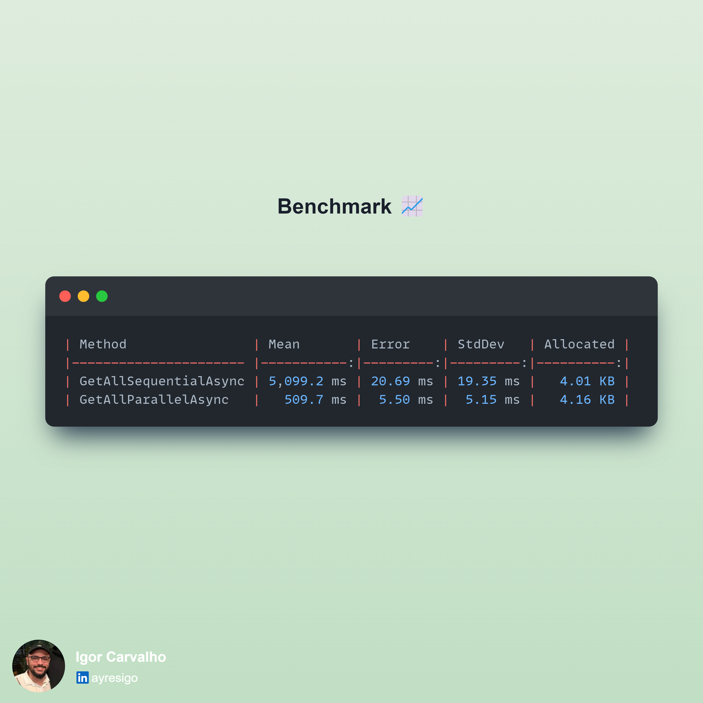

𝗦𝘂𝗽𝗲𝗿𝗰𝗵𝗮𝗿𝗴𝗶𝗻𝗴 𝗔𝘀𝘆𝗻𝗰 𝗶𝗻 𝗖#: 𝗖𝗼𝗺𝗽𝗮𝗿𝗲 𝗦𝗲𝗾𝘂𝗲𝗻𝘁𝗶𝗮𝗹 𝘃𝘀. 𝗣𝗮𝗿𝗮𝗹𝗹𝗲𝗹 𝘄𝗶𝘁𝗵 𝗧𝗮𝘀𝗸.𝗪𝗵𝗲𝗻𝗔𝗹𝗹 ⚡

Hey Devs! 👋 
Have you ever wanted to call multiple services or run multiple tasks at once without waiting for each one to finish before starting the next? That's exactly where 𝗧𝗮𝘀𝗸.𝗪𝗵𝗲𝗻𝗔𝗹𝗹 comes to the rescue! Instead of running each task one by one (which can be slow if each task takes a while), you can fire them all simultaneously, wait for all to complete, and then process the results in bulk.

Below, we have a 𝘉𝘦𝘯𝘤𝘩𝘮𝘢𝘳𝘬𝘋𝘰𝘵𝘕𝘦𝘵 setup that measures:

1. 𝗦𝗲𝗾𝘂𝗲𝗻𝘁𝗶𝗮𝗹 𝗿𝗲𝗾𝘂𝗲𝘀𝘁𝘀 (one after another).
2. 𝗣𝗮𝗿𝗮𝗹𝗹𝗲𝗹 𝗿𝗲𝗾𝘂𝗲𝘀𝘁𝘀 (all at once using 𝘛𝘢𝘴𝘬.𝘞𝘩𝘦𝘯𝘈𝘭𝘭).

By measuring both approaches, we’ll see how 𝘛𝘢𝘴𝘬.𝘞𝘩𝘦𝘯𝘈𝘭𝘭 can significantly reduce the overall time when dealing with I/O-bound tasks such as HTTP calls. 
Let’s dive in! 🏊‍♂️

𝗪𝗵𝘆 𝘂𝘀𝗲 𝙏𝙖𝙨𝙠.𝙒𝙝𝙚𝙣𝘼𝙡𝙡? 💡
1. 𝗧𝗶𝗺𝗲 𝗦𝗮𝘃𝗶𝗻𝗴𝘀
If each request takes 500 ms, and you have 10 requests, a sequential approach might end up taking ~5000 ms. With 𝘛𝘢𝘴𝘬.𝘞𝘩𝘦𝘯𝘈𝘭𝘭, it could take around 500 ms total (assuming all 10 run simultaneously)!

2. 𝗖𝗹𝗲𝗮𝗻𝗲𝗿 𝗖𝗼𝗱𝗲
Instead of a big 𝘧𝘰𝘳𝘦𝘢𝘤𝘩 that awaits every single call, you collect all tasks in a list and await them together. Easy to read and maintain!

3. 𝗕𝗲𝘁𝘁𝗲𝗿 𝗥𝗲𝘀𝗼𝘂𝗿𝗰𝗲 𝗨𝘁𝗶𝗹𝗶𝘇𝗮𝘁𝗶𝗼𝗻
While one request is waiting on network I/O, others can proceed. This helps maximize concurrency without writing complex multi-threaded logic.

𝗘𝘅𝗽𝗲𝗰𝘁𝗲𝗱 𝗢𝘂𝘁𝗰𝗼𝗺𝗲 & 𝗧𝗮𝗸𝗲𝗮𝘄𝗮𝘆𝘀 🤔
𝗦𝗲𝗾𝘂𝗲𝗻𝘁𝗶𝗮𝗹 (𝘎𝘦𝘵𝘈𝘭𝘭𝘚𝘦𝘲𝘶𝘦𝘯𝘵𝘪𝘢𝘭𝘈𝘴𝘺𝘯𝘤): Runs each HTTP-like call one by one, typically summing all delays (e.g., 10 × 500 ms).

𝗣𝗮𝗿𝗮𝗹𝗹𝗲𝗹 (𝘎𝘦𝘵𝘈𝘭𝘭𝘗𝘢𝘳𝘢𝘭𝘭𝘦𝘭𝘈𝘴𝘺𝘯𝘤): Initiates all tasks at once and waits for them together, drastically reducing total time if each call is I/O-bound.

Feel free to share your thoughts or experiences with parallel async calls! Do you have any real-world story of boosting performance with 𝘛𝘢𝘴𝘬.𝘞𝘩𝘦𝘯𝘈𝘭𝘭? Let us know in the comments! 🎉

# [View on Linkedin](https://www.linkedin.com/feed/update/urn:li:activity:7280699390116155393/)
